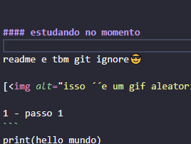

# leia-me
projeto de testes

## para que serve?
tralhar em grupo e estudar

### estudando no momento

- Danilo
<p>readme e tbm git ignore😎<P>

- xxxx
<P>------------------<P>


[]


```
print("hello world")

```
